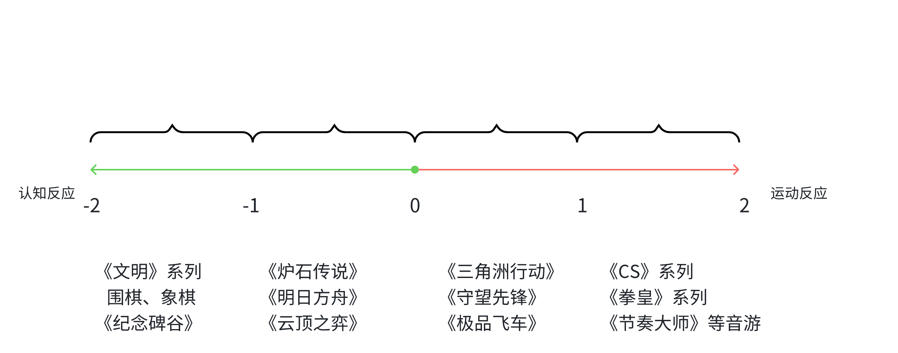

# 游戏反应模式设计策略：运动反应 vs 认知反应的选择与平衡

## 引言：笔者对游戏类型的一种分类

作为一个FPS类、策略类都有涉猎的玩家。在偶然间脑内复盘昨日对局时，思考：FPS类的拉枪定位，和策略类的思考对策，在原理上是不是同一种东西？在兴趣的驱使下，笔者进行了一些研究，发现这是两种截然相反的反应模式。基于此，笔者归纳出一套衡量标准：【运动反应主导】和【认知反应主导】。

## 两种反应模式的基础认知

### 运动反应主导

运动反应主导模式强调玩家的**快速反应能力**和**肢体运动技能**。这种模式下，玩家的成功主要依赖于：

- **快速而精确的手眼协调**：根据视听反馈，即刻做出肢体反应
- **肌肉记忆的建立**：通过大量练习形成的自动化操作
- **即时的反应速度**：在极短时间内做出正确的运动响应
- **精细的运动控制**：对输入设备的精确掌控

**典型代表**：《CS:GO》、《街霸》、《节奏大师》等

这类游戏的核心魅力在于**技艺精进的成就感**和**极限操作的快感**。玩家通过不断练习提升反应速度和操作精度，让机器成为类似自己“外置器官”的境界。

### 认知反应主导

认知反应主导模式强调玩家的**思维能力**和**决策水平**。这种模式下，玩家的成功主要依赖于：

- **策略规划能力**：制定长期和短期的游戏策略
- **信息处理速度**：快速分析复杂的游戏状态
- **逻辑推理能力**：基于已知信息推断最优决策
- **知识积累应用**：运用游戏机制知识解决问题

**典型代表**：《文明》系列、《三国杀》、围棋等

这类游戏的核心魅力在于**智力挑战的满足感**和**策略成功的成就感**。玩家通过深度思考和策略规划获得胜利，体验"运筹帷幄"的乐趣。

### 混合模式+不同侧重

绝大多数现代游戏都不是纯粹的单一反应模式，而是在不同程度上结合了两种模式：

- **运动为主，认知为辅**：如《守望先锋》《无畏契约》（射击技巧 + 英雄搭配策略）
- **认知为主，运动为辅**：如《最终幻想7重制版》《明日方舟》（战术决策 + 操作执行）
- **动态平衡模式**：如《星际争霸2》（不同阶段侧重点不同）

关键在于找到适合目标用户群体和商业目标的**最佳平衡点**。

## 不同反应模式数值设计的区别

从数轴最右侧的纯运动反应到最左侧的纯认知反应，本质上反映了游戏数值设计从**连续时间体系**向**离散时间体系**的转变。

### 运动反应-连续时间设计范式

**核心特征：**

- **时间精度**：通常为毫秒级（向玩家展示的数据通常以0.1s为最小调整单位）
- **数值平衡**：基于时间连续性的平滑调整
- **衡量标准**：击杀时间(TTK)、伤害每秒(DPS)等连续性指标

连续时间范式允许细微的数值调整，单个参数的小幅变动（如+0.1s冷却时间）对整体平衡的影响相对温和，符合运动反应游戏需要精细平衡的特点。典型场景包括技能冷却、换弹时间等。

### 认知反应-离散时间设计范式

**核心特征：**

- **时间精度**：回合级（以整数回合为单位）
- **数值平衡**：基于离散节点的阶跃式变化
- **衡量标准**：回合数、行动次数等离散性指标

离散时间范式中，任何+1回合的变化都会产生显著影响，这要求设计者在数值设计时必须考虑每个离散节点的完整影响链。

离散时间设计范式并非精度导向，时间都是以离散的回合数来计算的。但它却是不折不扣的精度依赖，因为离散时间下，没有中间量，只有以1为粒度的变化。任何一个时间上的变化，都会带来重大影响。

假设某debuff的效果是：携带该debuff的角色，在受到攻击时，会受到最大生命值5%的伤害。变动一粒度的时间单位：在连续时间下，0.1s内受到的攻击次数通常是很低的，因为人类的反应时间有极限，即使多0.1s，窗口期也很难把握，5人的队伍能有2人在窗口期中发起攻击就算优秀；但在离散时间下，多1回合的持续时间完全可以让所有角色对携带debuff的角色进行一次攻击。两种情况进行对比，就是10%和25%最大生命伤害的差距，效用比达到了2.5。

